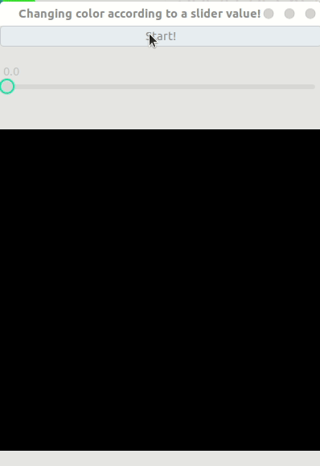

# Some Simple GTK Projects

## List of projects

- A cairo surface with a slider that can change the color of the surface

## 

## Build

The following commands will build a project:

```bash
cd project-name
meson build
cd build
meson compile
./project-name
```

